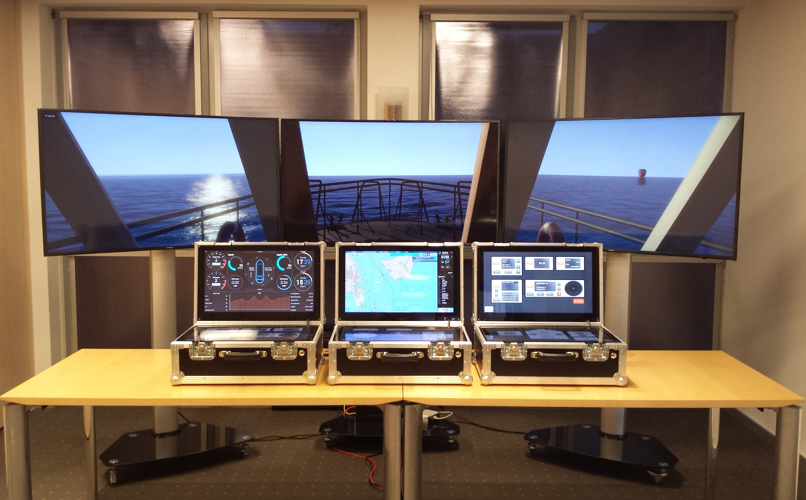

# Mobile Bridge - A Portable Design Simulator for Ship Bridge Interfaces



The Mobile Ship Bridge is a configurable ship’s bridge system in which new eNavigation technologies can be tested and demonstrated. In particular new interaction concepts are within the focus of the development. This includes both, the providing of information to nautical personal as well as new control concepts.
The portable structure of the system allows a straightforward demonstration of these concepts in a real system environment, e.g. on real ship bridges as the system can be connected to the sensors on board of the ship in parallel with the real systems. An additional vision system supports the design, development and demonstration of these interaction concepts within a virtual environment.

The System consists of two main components: The Mobile Bridge itself and the vision system.
 
The mobile bridge system is separated into three different segments that can be combined and connected with each other. Each of these segments is buildup of one information and one control element. Whereas the information element is realized as a multi-touch monitor. The control element could be either a multi-touch monitor or a set of bridge control elements like thrust levers or a steering "wheel". The multi-touch control element enables the testing of new concepts for virtual handles and controls. See the [Virtual Handles](https://github.com/tcstratmann/VirtualHandles) repository for an example of freely configurable virtual handles and information displays we use with our bridge elements.

To further ensure the portability of the bridge system, the hardware of the vision system is totally decoupled from that of the bridge system. 
The vision system is used to visualize a traffic simulation within a 3D environment. For this purpose the vision system consists of three additional displays, which are realized by a full HD curved television system, but can be easily replaced by utilizing video projectors.

Combined the two components form a fully functional Ship Bridge Simulator using either the open source Simulator Software [Bridge Command](https://bridgecommand.co.uk/) or our own in-house developed traffic simulation and models.

## Build Instructions

- Per Bridge Element you will need the hardware listed in the [Bill of Materials](BOM.md), we recommend building 3 units
- Use a lasercutter ([Settings](LasercutterConfig.md)) to cut the faceplates (([CAD files](CAD/)))
- Cut a 22 x 4 cm rectangular hole into the back of each flight case for the connectors
- Cut a 1 cm diameter hole into the front right corner of the flight case for the power button
- fix all components in the case as shown in the ([component placement overview](blueprints/placement.pdf))
- wire up all components as shown in the ([component wiring overview](blueprints/wiring.pdf))

## Academic Citation

We have been asked a few times about how to cite Mobile Bridge in academic research. If you are using Mobile Bridge as a tool in your research please cite the below TransNav 2018 journal paper.

> Stratmann T.C., Gruenefeld U., Stratmann J., Schweigert S., Hahn A., Boll S.: Mobile Bridge - A Portable Design Simulator for Ship Bridge Interfaces. TransNav, the International Journal on Marine Navigation and Safety of Sea Transportation, Vol. 12, No. 4, doi:10.12716/1001.12.04.16, pp. 763-768, 2018

Permalink: http://www.transnav.eu/Article_Mobile_Bridge_-_A_Portable_Design_Stratmann,48,863.html

BibTeX Style Citation:
```bibtex
@article{stratmann_mobile_2018,
	title = {Mobile {Bridge} - {A} {Portable} {Design} {Simulator} for {Ship} {Bridge} {Interfaces}},
	volume = {12},
	copyright = {All rights reserved},
	issn = {2083-6473},
	url = {http://www.transnav.eu/Article_Mobile_Bridge_-_A_Portable_Design_Stratmann,48,863.html},
	doi = {10.12716/1001.12.04.16},
	abstract = {Developing new software components for ship bridges is challenging. Mostly due to high costs of testing these components in realistic environments. To reduce these costs the development process is divided into different stages. Whereas, the final test on a real ship bridge is the last step in this process. However, by dividing the development process into different stages new components have to be adapted to each stage individually. To improve the process we propose a mobile ship bridge system to fully support the development process from lab studies to tests in realistic environments. Our system allows developing new software components in the lab and setting it up on a ship bridge without interfering with the vessel's navigational systems. Therefore it is linked to a NaviBox to get necessary information such as GPS, AIS, compass, and radar information. Our system is embedded in LABSKAUS, a test bed for the safety assessment of new e-Navigation systems.},
	number = {4},
	journal = {TransNav, the International Journal on Marine Navigation and Safety of Sea Transportation},
	author = {Stratmann, Tim Claudius and Gruenefeld, Uwe and Stratmann, Julia and Schweigert, Sören and Hahn, Axel and Boll, Susanne},
	year = {2018},
	keywords = {e-Navigation, Bridge Elements, Mobile Bridge, Modern Navigational Bridge, NaviBox, Navigational Bridge, Portable Design Simulator, Ship Bridge Interfaces},
	pages = {763--768}
}
```
